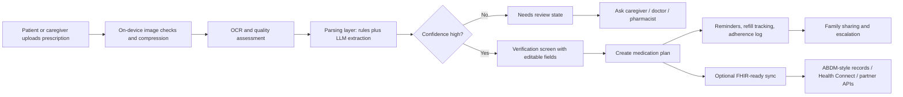

# Healthtech AI Strategy for Swasthi in India

## Executive summary

Swasthi should not position itself as “an AI medicine app” or merely “a pill reminder.” The strongest opportunity is to become a **trust-first family medication coordination layer** for India: capture prescriptions, convert them into a structured medication plan, verify unclear items, coordinate family caregivers, and gradually become interoperable with India’s digital health stack. That direction is strongly supported by Google’s health startup roadmap, Open Health Stack, Cloud Healthcare API, Health Connect, and recent India signals around ABDM, BHASHINI, and MedGemma. citeturn20view2turn14view1turn27view1turn22view0turn15view6turn14view13

The most important strategic lesson from current healthtech AI research is that **the bottleneck is no longer only model quality**. McKinsey finds that healthcare organizations now see **integration challenges, risk/safety concerns, and workflow redesign** as top barriers to scaling generative AI, while BCG emphasizes end-to-end workflow automation, at-home care, and data-driven personalization. For Swasthi, that means the winning product is likely one that fits real care routines—family reminders, refill continuity, escalation, and record-sharing—rather than a flashy chatbot. citeturn17view0turn17view1turn17view5

The safest and most useful product architecture is: **OCR → structured extraction → confidence scoring → human verification → reminders/refills/caregiver sharing**. This aligns with WHO and ICMR guidance that AI in health must center ethics, accountability, and human oversight, and it matches Google’s own caution that MedGemma is a starting point requiring validation and adaptation for specific healthcare use cases. citeturn14view6turn15view7turn14view12

Three immediate priorities stand out. First, design for India’s constraints: intermittent connectivity, low-cost Android phones, and multilingual/voice interactions. Second, make caregiver support a first-class feature, because research on adherence apps in Asia shows that reminder-only apps are common, while **multiuser support, feedback loops, and clinician/caregiver communication** are rarer and more promising. Third, keep the data model **FHIR-ready** from day one so the app can later connect to ABDM-style health records, hospitals, labs, or insurers without a full rewrite. Team size, budget, and launch geography are unspecified, so the roadmap below uses relative effort estimates rather than headcount-based project plans. citeturn28view0turn28view1turn15view6turn25view0turn14view5turn14view1

## Ecosystem signals from Google and India

Google’s official health startup guide is useful for Swasthi because it frames Google not as a single “AI tool,” but as a **stack of programs, infrastructure, and health-specific building blocks**. The guide explicitly points startups to Google for Startups, the Cloud Program, Gemini resources, Health AI Developer Foundations, Health Connect, and Open Health Stack. It describes Google Cloud as infrastructure for healthcare data and machine learning, Health Connect as a permissioned way to combine health and fitness data, and Open Health Stack as reusable components for “next-gen healthcare apps.” citeturn20view2turn20view1turn20view0

India’s public digital health direction matters just as much. ABDM is the national digital health backbone; ABHA gives citizens a health identifier and record-sharing capability; and the ABDM FHIR implementation guide explicitly defines the health-record artifacts and standards for exchange. In early 2026, BHASHINI and the National Health Authority signed an MoU to bring multilingual translation, speech recognition, and text-to-speech into ABDM and PM-JAY platforms, with an explicit focus on voice-enabled, language-inclusive healthcare delivery. For an India-first family medication app, those are not side signals—they are strong evidence that **multilingual, interoperable, citizen-facing health software** is where the ecosystem is moving. citeturn1search1turn14view5turn26search2turn15view6

Google’s India-specific health AI signal is also notable. In late 2025, Google announced funding to support India Health Foundation Models using MedGemma alongside AIIMS and Ajna Lens for India-specific dermatology and outpatient triage use cases. That suggests that localized, clinically grounded, India-specific model adaptation is becoming more important than generic “global” medical AI. citeturn14view13turn15view1

| Platform or program | What it offers Swasthi | Best use now | Main caveat | Sources |
|---|---|---|---|---|
| Google for Health Startups Guide | Curated map of Google programs, cloud, HAI-DEF, Health Connect, OHS | Strategic orientation and grant/program discovery | It is a roadmap, not a turnkey product plan | citeturn20view2 |
| Google for Startups Cloud Program | Up to $350k credits for AI-first startups, training, support | Offset early infra and model costs | Eligibility varies by stage and discretion | citeturn14view10turn29search7 |
| Open Health Stack | Android FHIR SDK, analytics, info gateway, design guidelines; offline-capable and low-resource oriented | FHIR-ready mobile architecture | Requires implementation effort and standards discipline | citeturn14view1turn16search3turn21view0 |
| Cloud Healthcare API | Managed FHIR/HL7v2/DICOM + de-identification + AI integrations | Back end for structured health data and future integrations | More powerful than many MVPs need on day one | citeturn27view1turn27view0turn27view3 |
| Health Connect | On-device health/fitness/medical-record sharing with user control | Optional vitals, meds, visits, wearables sync | Play declarations/permissions are required | citeturn14view3turn22view0 |
| MedGemma / HAI-DEF | Open health models for medical text and image comprehension | R&D for later medical-language features | Not for direct deployment without validation | citeturn14view12turn20view0 |

## Trends shaping AI medication apps

Across healthcare, AI adoption is maturing from experimentation to operational use. McKinsey’s 2026 survey says half of responding healthcare organizations had implemented generative AI use cases, and it highlights a decisive shift from novelty toward integration, ROI, and “agentic” workflows. However, the same survey finds that **risk and safety** and **integration into legacy systems** remain major barriers. For a startup like Swasthi, this means product-market fit will depend more on trust, workflow fit, and measurable utility than on having the most advanced model. citeturn17view1turn17view0turn17view2

BCG’s recent healthcare work points in a similar direction: AI-enabled care is moving toward wearable data, home-based care, and automation across full care workflows rather than isolated tasks. That is a strong fit for a medication coordination product, because medication adherence sits at the intersection of daily routine, chronic care, refill management, and family support. citeturn17view5turn17view3

On regulation and governance, the global and Indian signals are clear. WHO’s guidance says AI for health must put ethics and human rights at the center of design, deployment, and use; its 2025 publication on large multimodal models acknowledges their likely broad use in health. India’s ICMR guidelines were created specifically to guide ethical decision-making in AI for biomedical research and healthcare, and the DPDP Act requires consent to be free, specific, informed, unambiguous, and as easy to withdraw as it is to give. In practical product terms, this means Swasthi should avoid hidden consent, over-collection of data, and opaque AI outputs. citeturn14view6turn18view0turn15view7turn14view7

Interoperability is another major trend, not a technical detail. FHIR is the common standard for electronic health information exchange, and ABDM’s own implementation guide is built around those exchange artifacts. Open Health Stack is explicitly designed to make FHIR adoption easier, including in low-resource settings. For Swasthi, the business value of FHIR is simple: it lets one medication list eventually speak to hospitals, labs, insurers, pharmacies, and patient record systems. citeturn19search0turn14view5turn14view1

Finally, multilingual and low-resource design are now first-order requirements in India. Android’s Build for Billions guidance assumes slow, unstable, or expensive connectivity; low-memory devices; and the need for strong localization. BHASHINI’s official collaboration with NHA adds a further signal that voice-to-text, translation, and text-to-speech are becoming foundational for public-facing healthcare software in India. citeturn28view0turn28view1turn15view5turn15view6

## Product and technical implications for Swasthi

The most defensible product choice is a **trust architecture**, not just an AI layer. In practice, that means Swasthi should never turn raw model output directly into active reminders when confidence is low. Instead, it should show extracted medicine names, dose, schedule, and instructions with confidence markers and a “needs verification” state. That approach is justified by three separate signals: handwritten prescriptions remain difficult because of variability and abbreviations; Google’s Document AI can extract handwritten text and even assess document readability; and medical models like MedGemma explicitly require validation before use in a specific workflow. citeturn24search4turn15view4turn14view12

A practical high-level interaction model looks like this:

The UX should also reflect what adherence research says actually matters. A 2024 JMIR review of medication-adherence apps in Asia found that reminders are common, but stronger designs combine reminders with education, health-data recording, feedback from health professionals, motivational tools, and multiuser support. It also found that older users can find reminder notifications annoying, privacy concerns can reduce acceptability, and multiuser support is still underused despite caregiver value. That points to a Swasthi UX with **quiet reminders, clear escalation rules, simple confirmation, and family oversight** rather than constant nagging. citeturn25view0

A “WhatsApp-like” onboarding flow is a reasonable product bet for India, though it is still a design hypothesis rather than a proven law. The evidence in favor is indirect but persuasive: WhatsApp emphasizes simplicity, reliability, and use even on slow connections, while Android’s Build for Billions guidance says developers should design for poor connectivity, low memory, and localization. In Swasthi, that suggests short conversational steps, phone-number-first login, image upload before form filling, and easy share links for caregivers. citeturn16search4turn28view1turn28view0

Technically, the leanest strong stack is: Android app with local cache; image capture and compression; Document AI OCR; a medication extraction layer using rules plus Gemini on Vertex AI; a local medication model mapped to FHIR resources; optional storage/sync through Cloud Healthcare API if and when interoperability becomes necessary; and Health Connect only for selective, permissioned integrations such as vitals, visits, or medication records. Because Health Connect stores data on-device and lets users delete it, it can support privacy-sensitive health-data sharing without requiring Google cloud storage for everything. citeturn15view4turn27view1turn22view0turn14view3

## Go-to-market, partnerships, and competitor lessons

The clearest go-to-market wedge is **caregiver-first medication continuity**, especially for adult children managing parents, including NRIs coordinating care remotely. That has stronger differentiation than competing head-on with pharmacies, teleconsult apps, or general record lockers. Official product descriptions show the market is already split: Medisafe and MyTherapy focus on reminders, adherence, and journaling; Driefcase and ABHA focus on records and consented sharing; Tata 1mg and Apollo 24|7 focus on pharmacy, labs, consults, and delivery. The gap is the layer between them: “turn this prescription into a shared, verified, day-to-day medication system.” citeturn4search15turn4search9turn4search3turn26search2turn26search0turn26search5

| Competitor or adjacent player | Core strength | What it misses for Swasthi’s vision | Lesson |
|---|---|---|---|
| Medisafe | Strong medication reminders, tracking, family “Medfriends” | Limited India-specific interoperability and prescription understanding | Caregiver support matters, but reminders alone are not enough. citeturn4search15turn4search0 |
| MyTherapy | Reminder + pill counter + health journal | More self-management than family coordination | Logging and journaling improve usefulness, but coordination is the moat. citeturn4search9turn4search1 |
| Driefcase / ABHA | Family records, consented sharing, PHR/ABDM alignment | Not a medication workflow engine | FHIR/records are valuable, but adherence workflow is still underserved. citeturn4search14turn4search7turn26search2 |
| Tata 1mg / Apollo 24|7 | Commerce, delivery, diagnostics, consults | Not optimized for family medication governance | Partner them for fulfillment later; do not try to be them first. citeturn26search0turn26search5turn26search1 |

Partnership strategy should follow the product, not the other way around. In the first phase, the most realistic partnerships are with doctor clinics willing to validate workflows, pharmacies willing to handle refill or substitution queries, and community channels where caregivers already coordinate health decisions. Google’s Cloud Program and accelerator ecosystem can reduce compute cost and provide AI/Android mentorship; the India AI-first accelerator is especially relevant because it supports Seed-to-Series A startups with AI, Cloud, Android, product, and growth support, while Growth Academy: AI for Health cohorts remain region-specific and should be monitored opportunistically. citeturn14view11turn14view10turn29search0turn20view2

## Risks, failure modes, and a prioritized roadmap

The main risks are not hidden. First, clinical liability: hallucinated schedules, incorrect drug names, or misleading interaction claims can cause harm. Second, privacy and trust: family sharing can create accidental disclosure if permissions are sloppy. Third, retention: many adherence apps lose relevance after setup because reminders become repetitive and annoying. WHO, ICMR, and medication-adherence research all point toward the same mitigation strategy—human oversight, explicit consent, privacy by design, and utility that goes beyond reminders. citeturn14view6turn15view7turn25view0turn14view7

The roadmap below prioritizes **trust, caregiver value, offline resilience, and interoperability readiness**. Effort is relative because team size, budget, and current codebase maturity are unspecified.

| Timeline | Priority outcome | Concrete features | Effort | Expected impact |
|---|---|---|---|---|
| Month 1 | Safe medication capture | Prescription upload, image quality check, OCR, editable extraction screen, “needs review” badge | M | Very high |
| Month 2 | Reliable reminders that users keep | Quiet reminders, snooze/reschedule, taken/missed log, refill countdown, export/share summary | M | High |
| Month 3 | Caregiver coordination moat | Family roles, remote confirmations, missed-dose escalation, WhatsApp-style invite/share flow | M | Very high |
| Month 4 | India-first usability | Offline cache, low-RAM optimization, multilingual text, voice note intake or read-aloud instructions | M | High |
| Month 5 | Interoperability foundation | FHIR-ready internal schema, ABHA/record export groundwork, optional Health Connect read/write for selected data | L | High |
| Month 6 | Partner-ready product | Clinic/pharmacy dashboard lite, review queue for unclear prescriptions, analytics on missed doses/refills | L | Very high |

If only three features can be built first, the best trio is: **verified prescription-to-plan conversion**, **caregiver escalation**, and **refill continuity**. Those are where Swasthi can offer the most differentiated value relative to reminder apps, record lockers, and pharmacy apps. citeturn25view0turn4search15turn4search9turn4search3

## Recommended primary sources and limitations

The most useful pages to read next are these primary sources, because together they cover ecosystem, architecture, regulation, privacy, and product design: Google for Health Startups Guide; Open Health Stack overview and design guidelines; Cloud Healthcare API; Health Connect data types and privacy model; ABDM and ABDM FHIR guide; WHO and ICMR AI health ethics guidance; Build for Billions; MedGemma documentation; and Google for Startups Cloud/Accelerator pages. The citations below link directly to those materials. citeturn20view2turn14view1turn21view0turn27view1turn22view0turn14view5turn14view6turn15view7turn28view0turn14view12turn14view10turn14view11

Important limitations: your **team size, budget, regulatory counsel status, city/state launch plan, disease focus, current codebase maturity, and whether you already have doctor/pharmacy partners are unspecified**. Because of that, the roadmap emphasizes relative priority rather than exact staffing or cost projections. Also, some Google startup programs are cohort- and region-dependent, so eligibility should always be checked at the time of application. citeturn29search0turn14view11turn14view10

**Bottom line:** Google’s ecosystem is genuinely useful for Swasthi—but only if you use it to build a **safe, multilingual, caregiver-centered, FHIR-ready medication coordination product**, not a generic medical chatbot. That is the lane most consistent with current health AI guidance, India’s digital health direction, and the gaps left by existing apps. citeturn20view2turn14view1turn15view6turn25view0turn14view6turn15view7

