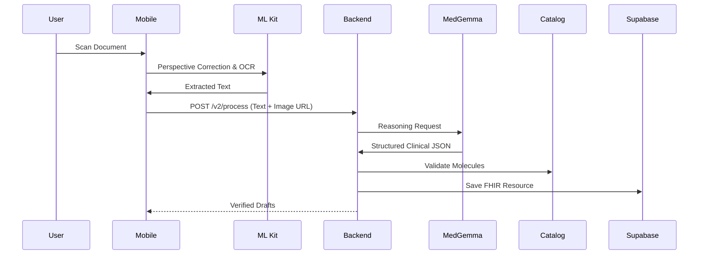

# Renomedy Modernization Design Document

**Role:** Principal Software Architect
**Status:** Draft / Engineering Blueprint
**Objective:** Transition to Prescription Intelligence Platform (ML Kit + MedGemma + FHIR)

---

## 1. Executive Summary

Renomedy is evolving from a cloud-assisted OCR tool into a comprehensive **Prescription Intelligence Platform**. The current architecture relies on high-latency cloud services (Google Vision and Gemini 2.0) for document processing. The target architecture shifts the heavy lifting of image processing to the **edge (mobile device)** and moves the clinical reasoning to a **specialized healthcare model (MedGemma 1.5 4B)**.

**Modernization Philosophy:**
*   **Edge-First OCR:** Move text extraction to the client to reduce costs and latency.
*   **Clinical Specialization:** Replace general-purpose LLMs with medical-tuned models.
*   **Interoperability:** Align internal schemas with international standards (FHIR).
*   **Reuse over Rewrite:** Leverage the highly stable database schema and safety logic developed in the initial phases.

---

## 2. Current vs Target Architecture

### Current System (Cloud-Centric)
```
User → Image Picker → Backend (Express) → Google Cloud Vision (OCR) → Google Gemini (General AI) → Supabase (DB)
```

### Target System (Hybrid Edge-Intelligence)
```
User → ML Kit Doc Scanner (Edge) → Quality Check (Edge) → ML Kit Text Recognition v2 (Edge)
      ↓
    Extracted Text
      ↓
    Backend (Express) → MedGemma 1.5 4B (Healthcare AI) → Validation Engine (Catalog Match)
      ↓
    FHIR Layer → Supabase (DB)
```

### Key Architectural Changes:
1.  **Extraction Shift:** OCR logic moves from Backend to Frontend.
2.  **Reasoning Swap:** Gemini (Commercial API) is replaced by MedGemma (Self-hosted/Edge-capable clinical model).
3.  **Data Modeling:** Introduction of a FHIR adapter layer for standardizing medication requests.
4.  **Pipeline Observability:** Increased segmentation (OCR Cleanup, Prescription Segmentation) for granular debugging.

---

## 3. Module-by-Module Migration Plan

| Module | Current Implementation | Target Implementation | Migration Strategy | Risk |
| :--- | :--- | :--- | :--- | :--- |
| **Frontend** | React Native Image Picker | ML Kit Document Scanner Integration | Component replacement; retain UI state logic. | Low |
| **Backend** | Central Orchestrator for Cloud OCR | Orchestrator for MedGemma & FHIR | Refactor `prescriptions.service` to accept text instead of buffers. | Medium |
| **OCR** | Google Cloud Vision | ML Kit v2 (On-device) | Implement native modules for React Native. | Medium |
| **AI** | Gemini 2.0 Flash | MedGemma 1.5 4B | Update prompt engineering & inference endpoint. | High |
| **Database** | Supabase/PostgreSQL | Supabase (with FHIR JSONB support) | Keep existing schema; add `fhir_payload` columns. | Low |
| **Catalog** | Sharded CSV Index | Sharded CSV + Fuzzy Sync | Keep logic; update `medicineIntelligence.ts` fuzzy match. | Low |
| **Validation** | Molecule Overlap Logic | MedGemma-Verified Validation | Integrate MedGemma reasoning into safety checks. | Medium |
| **FHIR** | Relational/Custom JSON | HL7 FHIR R4 Standard | Implement mapping layer in Backend services. | Medium |

---

## 4. File-Level Migration Plan

### Remain Unchanged
*   `Backend/supabase/migrations/`: Core schema is solid.
*   `Frontend/src/theme/`: Visual identity remains consistent.
*   `Backend/src/modules/family/`: Membership and RLS logic is production-grade.

### Require Refactoring
*   `Backend/src/services/ocr/ocr-provider.factory.ts`: Add `MlKitMedGemmaProvider`.
*   `Backend/src/modules/prescriptions/prescriptions.service.ts`: Update to support edge-extracted text payloads.
*   `Frontend/src/screens/PrescriptionHubScreen.tsx`: Modernize the upload flow for ML Kit feedback.

### Require Replacement
*   `Backend/src/services/ocr/google-vision-text.ts`: Deprecated in favor of client-side extraction.
*   `Backend/src/services/ocr/gemini-prescription-parse.ts`: Replaced by MedGemma-specific prompts.

### New Implementation
*   `Frontend/src/lib/mlkit-scanner.ts`: Interface for native ML Kit modules.
*   `Backend/src/services/fhir/fhir-adapter.service.ts`: Transformation logic for HL7 compatibility.

---

## 5. API Migration Plan

### Existing APIs (Kept)
*   `GET /prescriptions/history`
*   `POST /medications/activate`
*   `POST /medications/log-dose`

### New APIs Required
*   `POST /api/process-edge-text`: High-performance endpoint for receiving ML Kit text and returning MedGemma structured JSON.

### Deprecated APIs
*   `POST /api/scan-prescription` (Multipart/buffer version will be phased out for cost reduction).

### Versioning Strategy
*   Move to URI versioning: `/v1/...` (Current) and `/v2/...` (Modernized Edge-First).

---

## 6. Database Migration Plan

**Strategy:** The current schema already supports standard medical entities. No destructive changes are required.

**New Columns:**
*   `prescriptions`: `mlkit_version`, `fhir_resource` (jsonb).
*   `prescription_medications`: `clinical_confidence_score` (MedGemma metric).

**Backward Compatibility:**
*   The `parsed_medicine_json` column will be kept to ensure old prescriptions remain readable by the UI.

---

## 7. OCR Modernization Strategy

### Client Responsibilities (The "Edge")
*   **Scanning:** Use ML Kit Document Scanner for perspective correction and cropping.
*   **Feedback:** Real-time blur detection and "Move Closer" prompts.
*   **Extraction:** Convert image to text locally using ML Kit Text Recognition v2.

### Backend Responsibilities
*   **Cleanup:** Correct OCR artifacts (e.g., "1ng" → "1mg") using regex and catalog lookups.
*   **Segmentation:** Distinguish between Doctor Info, Patient Info, and Medication Rows.

### Fallback & Offline
*   **Fallback:** If ML Kit confidence is <60%, prompt user for manual capture and use Backend Vision OCR.
*   **Offline:** Store scanned images in a local queue; process through MedGemma when connectivity returns.

---

## 8. AI Modernization Strategy

### MedGemma 1.5 4B Integration
*   **Prompting:** Shift from instructions like "Find medicines" to "Map OCR tokens to FHIR MedicationRequest syntax."
*   **JSON Validation:** Use Zod on the Backend to enforce strict schema adherence from MedGemma output.
*   **Deployment:** Deploy MedGemma on a GPU-accelerated microservice (e.g., AWS Inf2 or Vertex AI) to ensure <2s reasoning time.

---

## 9. Data Flow Diagrams

### Prescription Intelligence Flow


---

## 10. Deployment Architecture

*   **App:** Expo/React Native (Distribution via EAS).
*   **API:** Node.js/Express (Vercel or AWS ECS).
*   **Database:** Supabase (PostgreSQL + RLS).
*   **AI Inference:** Private API endpoint hosting MedGemma (Ollama or vLLM container).
*   **Communication:** HTTPS with Clerk JWT for all internal/external routes.

---

## 11. Testing Strategy

*   **OCR Benchmarking:** Comparative analysis of ML Kit vs. Vision OCR on 100 sample handwritten prescriptions.
*   **Safety Validation:** Automated "Intervention Tests" where MedGemma must detect contraindications correctly.
*   **Performance:** Latency tracking for the full scan-to-verify loop (Target: <5 seconds).

---

## 12. Risk Analysis

| Risk | Impact | Mitigation |
| :--- | :--- | :--- |
| MedGemma Hallucination | High | Strict confidence scoring + mandatory user verification. |
| Edge OCR Performance | Medium | Background processing for text extraction; fallback to Cloud Vision. |
| FHIR Complexity | Low | Implement as an additive layer, not a schema replacement. |

---

## 13. Engineering Sprint Plan

### Sprint 1: The Edge Foundation
*   **Goal:** Implement ML Kit scanning.
*   **Tasks:** Native module integration; Document Scanner UI; Edge-to-Backend text delivery.

### Sprint 2: Clinical Intelligence
*   **Goal:** Replace Gemini with MedGemma.
*   **Tasks:** MedGemma prompt engineering; Inference service deployment; Structured JSON mapping.

### Sprint 3: Interop & Ecosystem
*   **Goal:** FHIR readiness.
*   **Tasks:** FHIR adapter implementation; Data export tools; Final safety engine hardening.

---

## 14. Success Metrics

*   **P90 Latency:** <3s for OCR extraction.
*   **Extraction Accuracy:** >90% brand name match compared to ground truth.
*   **User Correction Rate:** <20% of fields changed by users during verification.
*   **Cost Efficiency:** >70% reduction in Cloud OCR API costs.

---
**End of Modernization Design Document**
