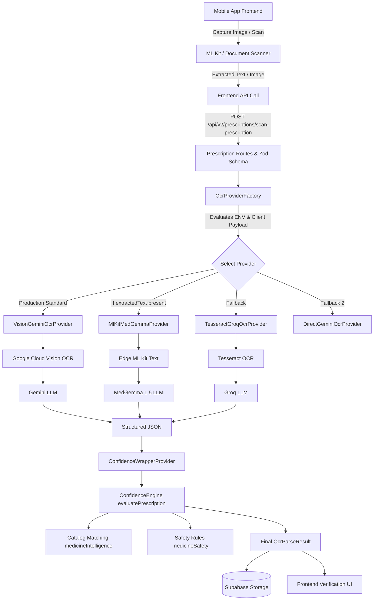
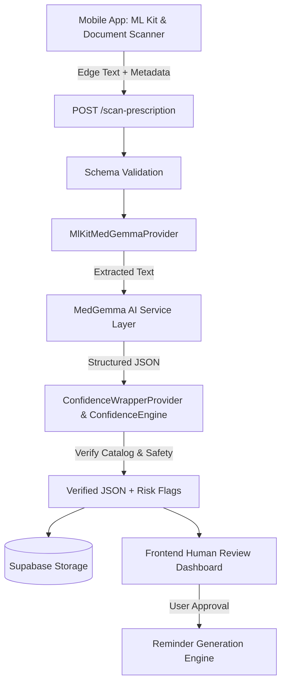

# Renomedy OCR Pipeline Audit

## 1. Current State Audit

The OCR pipeline is orchestrated by the `OcrProviderFactory` and handles prescription images across multiple providers.

### Workflow Stages

**1. Input Acquisition (Frontend)**
- **Inputs**: Prescription image captured via device camera or gallery.
- **Outputs**: Image Buffer or Edge-extracted text (`metadata.extractedText` via ML Kit).
- **Dependencies**: React Native Expo, ML Kit (`@react-native-ml-kit/text-recognition`), Document Scanner Plugin.
- **Failure Modes**: Poor lighting, blurry images, truncated scans.
- **File Paths**: `Frontend/src/screens/PrescriptionHubScreen.tsx`, `Frontend/src/lib/api.ts`

**2. Routing & Orchestration (Backend)**
- **Inputs**: Image Buffer, `ocrMetadata`, `extractedText`.
- **Outputs**: Delegated OCR Provider instance wrapped in `ConfidenceWrapperProvider`.
- **Dependencies**: Express routes, multer for multipart/form-data.
- **Failure Modes**: Zod schema silently dropping `ocrMetadata` (Resolved with `z.any()`), missing ENV variables causing fallback behavior.
- **File Paths**: `Backend/src/modules/prescriptions/prescriptions.routes.ts`, `Backend/src/services/ocr/ocr-provider.factory.ts`

**3. Text Extraction (OCR)**
- **Providers**: `VisionGeminiOcrProvider` (Cloud Vision - Production Standard), `MlKitMedGemmaProvider` (Edge ML Kit - Experimental), `TesseractGroqOcrProvider` (Tesseract - Fallback).
- **Inputs**: Image Buffer or pre-extracted text.
- **Outputs**: Raw text string.
- **Dependencies**: Google Cloud Vision API, Tesseract OCR.
- **Failure Modes**: Network timeout (Vision), low-quality edge extraction (ML Kit).
- **File Paths**: `Backend/src/services/ocr/google-vision-text.ts`, `Backend/src/services/ocr/mlkit-medgemma.provider.ts`

**4. Clinical Structuring (AI Reasoning)**
- **Inputs**: Cleaned raw text.
- **Outputs**: JSON Array of medications (Name, Strength, Dosage, Frequency, Duration).
- **Dependencies**: Google GenAI (Gemini), Groq, MedGemma Prompts.
- **Failure Modes**: Model hallucination, malformed JSON output, timeout.
- **File Paths**: `Backend/src/services/ocr/medgemma-prescription-parse.ts`, `Backend/src/services/ocr/gemini-prescription-parse.ts`

**5. Trust Layer & Validation (Confidence Engine)**
- **Inputs**: Parsed medication array.
- **Outputs**: Evaluated medications with `confidenceScore`, `confidenceLevel`, `riskFlags`, and `requiresManualVerification`.
- **Dependencies**: `medicineIntelligence.ts` (Catalog Matching), `medicineSafety.ts` (Excluded Meds).
- **Failure Modes**: False positive risk flags, catalog mapping failures.
- **File Paths**: `Backend/src/utils/confidenceEngine.ts`, `Backend/src/services/ocr/ocr-provider.factory.ts`

**6. Reminder Generation & Storage**
- **Inputs**: Verified medications with timing/frequency.
- **Outputs**: Database persistence and Scheduled CRON Jobs.
- **Dependencies**: Supabase (DB), `node-cron` (Backend scheduler), FCM (Push Notifications).
- **Failure Modes**: Misparsed frequency leading to incorrect schedules, DB schema mismatch.
- **File Paths**: `Backend/src/modules/prescriptions/prescriptions.controller.ts`

---

## 2. Current State Architecture Diagram

---

## 3. Bottleneck Analysis

| Bottleneck | Component | Classification | Description |
| :--- | :--- | :--- | :--- |
| **Latency: Server Image Processing** | `VisionGemini` | High | Uploading full images and waiting for Google Cloud Vision adds 3-5 seconds of latency per scan. |
| **Latency: Model Generation** | LLM Providers | Medium | Gemini/MedGemma text generation can vary based on load. Exponential backoff mitigates but adds delay. |
| **Parsing: Hallucinations** | AI Structuring | High | Generic Gemini can hallucinate or misinterpret ambiguous abbreviations compared to MedGemma. |
| **Validation: Hardcoded Catalogs** | `medicineIntelligence` | Medium | In-memory CSV catalog matching may become a bottleneck as the dataset grows significantly. |
| **Reminder Generation** | `node-cron` | Low | Current scheduling works but will require a distributed message queue (e.g., Redis/BullMQ) for high scale. |

---

## 4. Error-Prone Areas

| Area | Likelihood | Impact | Mitigation |
| :--- | :--- | :--- | :--- |
| **Handwriting ambiguity** | High | Critical (Wrong Drug) | ConfidenceEngine overrides score to `Manual Verification Required` for low OCR quality. |
| **OCR mistakes** | High | Medium (Typo in Drug Name) | `medicineIntelligence` fuzzy matches catalog entries to bypass common typos. |
| **Missing dosage information** | Medium | High (Ineffective Tx) | `MISSING_DOSAGE` risk flag forces manual review. |
| **Missing frequency information** | Medium | High (Adherence Failure) | `AMBIGUOUS_TIMING` risk flag alerts user for missing schedule. |
| **Medicine name errors** | Low | Critical (Fatal Interaction) | Catalog mismatch sets score to 0 and adds `UNKNOWN_MEDICINE` flag. |
| **Abbreviations** | High | Medium (Wrong Time) | MedGemma prompt expansion & `AMBIGUOUS_TIMING` risk flag. |
| **Multi-line prescriptions** | Low | Low (Missing Drug) | ML Kit Document Scanner guides users to capture full pages. |

---

## 5. Validation Layer Audit

### Current Validation Logic
Centralized in `ConfidenceEngine` (`Backend/src/utils/confidenceEngine.ts`):
- **Medicine Validation**: Cross-references against `swasthi_beta_intelligence_v2.csv` (`medicineIntelligence.ts`). Awards +30 points.
- **Dosage Validation**: Checks for presence of `dosage` or `strength`. Awards +25 points. Triggers `MISSING_DOSAGE` flag if absent.
- **Schedule/Frequency Validation**: Checks for presence of `frequency` or `timing`. Awards +15 points.
- **Safety Overrides**: If any critical flag (`MISSING_DOSAGE`, `FAILED_VALIDATION`, `UNKNOWN_MEDICINE`, `SUSPICIOUS_MEDICATION_PATTERN`) is present, it forces `requiresManualVerification: true` regardless of points.

### Missing / Required Validation Logic
- **Duration Validation**: No specific risk flag exists for missing duration, which is critical for antibiotic compliance.
- **Drug-Drug Interactions (DDI)**: Currently checks for "Excluded Medicines" (e.g., Insulin, Warfarin) via `medicineSafety.ts`, but lacks true interaction checking between prescribed drugs.

---

## 6. MedGemma Integration Points

**Current Implementation State:**
- `mlkit-medgemma.provider.ts` exists and acts as the orchestrator.
- `medgemma-prescription-parse.ts` contains the prompt, Zod schema (`MEDGEMMA_SCHEMA`), and JSON extraction logic.
- The provider correctly intercepts `metadata.extractedText` from the mobile client.

**Strengths:**
- Clean separation of concerns (Decouples OCR text extraction from AI reasoning).
- Strong typing and fallback to `Google Cloud Vision` if edge extraction fails.

**Weaknesses:**
- Currently simulates MedGemma using `gemini-2.0-flash` due to deployment constraints (as seen in `mlkit-medgemma.provider.ts`).

**Required API Contracts (Current):**
- Input: `extractedText` passed inside the `ocrMetadata` object of the `/scan-prescription` POST request.
- Output: Array of objects matching `MEDGEMMA_SCHEMA` (Name, Strength, Dose, Frequency, Duration, Instructions, Confidence, NeedsReview).

**Recommended Improvements:**
- Finalize the transition from `gemini-2.0-flash` simulation to the actual self-hosted or dedicated MedGemma endpoint when available.
- Ensure `confidence` from MedGemma maps directly to the `aiValidationFailed` metadata used by the `ConfidenceEngine`.

---

## 7. Human Review Flow

1. **Confidence Scoring**: `ConfidenceEngine` evaluates the LLM output and assigns a score (0-100) and Risk Flags.
2. **Warning Generation**: Risk flags translate to user-facing warnings (e.g., "Dosage missing - Please verify").
3. **Manual Correction**: Frontend `PrescriptionHubScreen` displays an interactive form for medications marked `requiresManualVerification: true`.
4. **Prescription Approval**: User confirms the mapped data.
5. **Fallback Mechanisms**: If OCR fails entirely, the system falls back to a purely manual data entry flow.

---

## 8. Recommended Beta Architecture

---

## 9. Technical Debt Analysis

| File Path | Description | Severity | Estimated Effort |
| :--- | :--- | :--- | :--- |
| `Frontend/src/screens/OnboardingScreen.tsx` | Auth mismatch (Phone vs Email) preventing user login consistency. | P0 | 0.5 Days |
| `Backend/src/services/ocr/medgemma-prescription-parse.ts` | MedGemma is simulated via `gemini-2.0-flash`; needs connection to real MedGemma service. | P1 | 1.0 Day |
| `Frontend/src/screens/PrescriptionHubScreen.tsx` | Network failure state relies on generic errors; needs distinct manual fallback UI for OCR timeouts. | P1 | 1.0 Day |
| `Backend/src/utils/confidenceEngine.ts` | Missing duration risk flag for critical compliance validation. | P2 | 0.5 Days |
| `Backend/src/services/ai/validation.ts` (if exists) | Unhandled 500 errors on complete JSON failure instead of graceful manual fallback. | P1 | 0.5 Days |

---

## Engineering Action Items

1. **Fix P0 Blocker**: Immediately align `OnboardingScreen` and `LoginScreen` auth methods (Email vs Phone).
2. **Harden Frontend Fallbacks**: Implement specific error boundaries in `PrescriptionHubScreen` to route to manual entry upon backend OCR timeout.
3. **MedGemma Readiness**: Coordinate with Claude (Architecture Agent) to swap the `gemini-2.0-flash` simulation in `MlKitMedGemmaProvider` to the production MedGemma endpoint.
4. **Deploy Beta**: Once P0 and P1s are cleared, execute the 100-family beta rollout.
